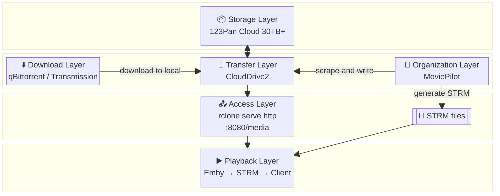

## Introduction

Previously I wrote about [「Tianyi Cloud Drive + CloudDrive2 + Rclone: A Stable and Reliable Photo Encryption Backup Solution」](https://www.binwh.com/2026/03/11/tianyi-clouddrive2-rclone-backup/), where the CloudDrive2 + Rclone toolchain solved encrypted photo backups. This time I'm dealing with dozens of terabytes of media files, all stored in chunks in the cloud. The remaining task is implementing the media center architecture.

After some experimentation, the final architecture uses **rclone chunker + CloudDrive2** for media file chunking and transfer, and **rclone http + Emby** for playback. This runs a cloud-chunk-based media center on a Synology NAS ([click to see the effect](https://1842874625.share.123pan.cn/123pan/fz2UTd-zRvl3?pwd=NYyt)).

This setup satisfies several requirements:

- **Large capacity**: 123Pan membership starts at 30 TB and can scale to 100 TB
- **Stable transfer**: CloudDrive2 handles upload and download reliably, avoiding the freezes and disconnections common with large file transfers
- **No local disk usage**: Media files are not stored as complete local copies; only STRM files and poster images are kept locally
- **Emby playback**: Normal scanning, indexing, and streaming playback

## Architecture Overview

The solution is divided into four layers from bottom to top:

**Core path (top to bottom)**:

1. **Storage Layer**: 123Pan cloud storage, pure storage
2. **Transfer Layer**: CloudDrive2, responsible for API communication with 123Pan, upload/download, resume transfer, and local caching
3. **Access Layer**: rclone `serve http`, providing HTTP file service via `media:` (chunker merged view)
4. **Playback Layer**: Emby Server scans STRM directory, AfuseKt / browser / screen casting playback

**Side paths (bypassing the core path)**:

- **Download Layer**: qBittorrent / Transmission for downloading and seeding. After files are downloaded locally, they are copied to the cloud and chunked via rclone commands or Python scripts — currently a manual process.
- **Organization Layer**: MoviePilot for scraping and renaming. STRM files are text files that can be batch-generated programmatically; media NFO and poster files can be fetched via scripts from the rclone HTTP service. The STRM generation plugin in MP is not integrated yet, so this is a semi-manual process.

## Core Technology Decisions

### Why rclone chunker

I only casually compared two solutions for media file chunked storage:

- **JuiceFS**: A distributed file sharding storage recommended by a colleague. Powerful, but the dependency stack of metadata service + object storage backend is too heavy for personal NAS users. Just getting Redis/MySQL running stably is enough to deter most people.
- **rclone chunker**: One binary + one config file, connecting to CloudDrive2 via WebDAV, with chunker doing the splitting and merging on top. The learning curve and maintenance cost are both acceptable.

I chose rclone chunker because the difficulty level was "just right."

### Why add CloudDrive2

In actual use, I found that rclone connecting directly to 123Pan WebDAV was not stable enough for large files — uploads would hang for long periods, connections would drop, and so on. CloudDrive2 communicates with the cloud drive and handles resume transfer and caching optimization, isolating the unstable transfer problems from rclone.

After introducing CD2, rclone became purely a **chunker splitting and merging + HTTP file service** tool, no longer responsible for data transfer.

### Why HTTP service instead of FUSE mount

rclone provides HTTP file service rather than FUSE mount, mainly to avoid the overhead of mounting.

`rclone mount` introduces a FUSE (Filesystem in Userspace) layer. Every file operation (open, read, status query) requires switching between user space and kernel space, producing additional CPU overhead. For high-frequency random read scenarios like 4K playback, FUSE overhead is not negligible.

On the other hand, CloudDrive2 does its own file caching. The VFS cache that rclone needs is already covered by CD2. Rclone doesn't need to mount another FUSE layer for local caching; it can directly `serve http` and return file segments on demand.

Simply put: CD2's caching replaces the need for rclone VFS caching. Rclone only needs to handle chunk merging and HTTP transfer; no FUSE mount is required.

### Three remote configurations

rclone registers three remotes with clear roles:

- **`cd2`** (WebDAV remote): Directly connects to CloudDrive2's WebDAV service. CloudDrive2 itself handles API communication with 123Pan, resume transfer, and local caching.
- **`mediaware`** (alias remote): Points to the chunked storage directory on the cloud drive, where `.rclone_chunk.###` fragments are stored directly.
- **`media`** (chunker remote): Wraps `mediaware`, automatically merging chunks into complete files when reading. Emby sees merged large files.

## Layer Responsibilities

### Transfer Layer: CloudDrive2

CloudDrive2 is the transfer hub of the entire solution. It communicates with 123Pan through the official API, handling all upload, download, resume transfer, and local caching. Rclone is unaware of network details and only handles chunk merging.

I chose CloudDrive2 over letting rclone connect directly to WebDAV mainly for transfer stability. Rclone's WebDAV is not stable enough for large file scenarios; CD2's API communication + resume transfer + caching mechanism is more reliable.

### Access Layer: rclone serve http

Rclone no longer mounts FUSE, only providing HTTP file service via `serve http`. Emby scans the STRM directory to build the media library index. STRM files contain HTTP URLs (e.g., `http://NAS_IP:8080/media/Movies/xxx.mkv`). During playback, Emby fetches content directly via HTTP.

This approach has two benefits: STRM files are no longer bound to local FUSE paths and can be consumed by any HTTP client; it also avoids the performance overhead of FUSE mounting.

### Playback Layer: Emby + AfuseKt

Emby is the only playback service on the core path. I use [AfuseKt](https://github.com/AttemptD/AfuseKt-release) (Android / TV) to connect to the Emby server and browse and play the media library. Emby web version and screen casting also work.

### Download and Organization Layers (Side Paths)

Download and organization are independent of the rclone core path, reading and writing cloud files through the CloudDrive2 mount point:

- **Download**: qBittorrent fetches new torrents, Transmission handles long-term seeding. After files are downloaded locally, they are copied to the cloud and chunked via rclone commands or Python scripts. This process is not yet automated.
- **Organization**: MoviePilot handles scraping and renaming. STRM files are plain text and can theoretically be batch-generated programmatically; media NFO and poster files can be fetched via scripts from the rclone HTTP service. The STRM generation plugin in MP is not integrated yet, so this is a manual/semi-manual process.

## Practical Benefits

This solution delivers three concrete benefits:

**1. Chunked merging hides media characteristics**

With `chunk_size` set to 64M, cloud files exist as `.rclone_chunk.###` fragments. During playback, rclone automatically and transparently merges them. The server only sees sequential binary chunks; the film and television content characteristics are completely hidden.

**2. Transfer and merging are decoupled**

CloudDrive2 exposes itself to rclone via WebDAV. Rclone only handles chunk merging and does not deal with network transfer. CD2 itself handles resume transfer, caching, and API communication with 123Pan. Transfer stability is CD2's responsibility.

**3. HTTP service, no FUSE dependency**

rclone `serve http` directly provides HTTP file service. Emby fetches content purposefully via STRM. STRM files are no longer bound to local paths and can be consumed by any HTTP client, with no need for FUSE mounting.

## Known Limitations

This solution also has obvious drawbacks:

- **Chunk integrity**: Exceptions during chunked uploads may cause individual `.rclone_chunk.###` fragments to be corrupted or lost. Rclone has internal verification mechanisms to detect this and will retry on its own. However, there are occasional cases where `rclone copy` needs to be re-executed.
- **Cloud drive instant transfer disabled**: After chunker splitting, file hashes change completely. The cloud drive cannot recognize media file characteristics, so instant transfer is no longer possible.
- **Cannot use cloud drive direct links**: After chunking, only `.rclone_chunk.###` fragments exist in the cloud. It is impossible to generate public direct links for playback like with ordinary files.
- **Technical barrier**: The entire solution involves rclone configuration, systemd services, Docker, Synology package sources, CloudDrive2 WebDAV, and more. It requires a certain level of computer knowledge and hands-on ability to deploy and troubleshoot.

## Conclusion

This architecture is suitable for the following scenarios:

- NAS storage is running out and you want to use cloud storage to expand capacity
- You have requirements for transfer stability (large file upload/download)
- You want Emby playback without relying on local complete copies
- You don't mind manual/semi-automatic organization workflows

The following scenarios are less suitable:

- You want to play media files directly via public direct links
- You need cloud drive instant transfer capability
- You want fully automated organization (STRM auto-generation, etc.)
