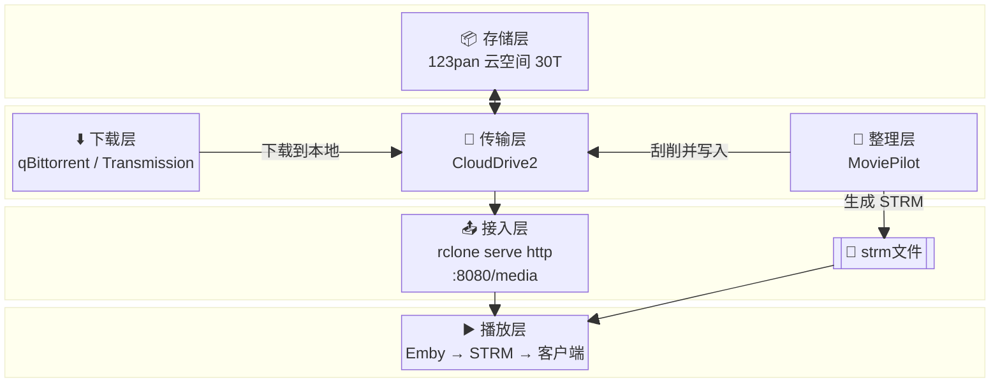

## 引言

之前写过 [《天翼云盘 + CloudDrive2 + Rclone：打造稳定可靠的照片加密备份方案》](https://www.binwh.com/2026/03/11/tianyi-clouddrive2-rclone-backup/)，用 CloudDrive2 + Rclone 这套工具链解决了照片的加密备份。这次要面对的是几十 TB 的媒体文件，全部分块存储在云空间，剩下的就是实现媒体中心的技术方案。

折腾了一段时间，最后落地的架构核心是使用 **rclone chunker + CloudDrive2** 实现媒体文件分块和传输；使用 **rclone http + Emby** 进行播放。这样就在群晖 NAS 上跑了一套以云端分块（[点击查看效果](https://1842874625.share.123pan.cn/123pan/fz2UTd-zRvl3?pwd=NYyt)）为存储核心的多媒体中心。

这套方案里能满足这几个需求：

- **大容量**：[123 云盘](https://1842874625.share.123pan.cn/123pan/fz2UTd-zRvl3?pwd=NYyt)会员 30T 起步，并可以持续增长到 100T
- **稳定传输**：通过 [CloudDrive2](https://www.clouddrive2.com/) 实现稳定上传和下载，避免大文件上传下载不要动不动就卡住的问题
- **不占本地磁盘**：媒体文件不在本地存完整副本，在本地保留strm文件和海报图片
- **Emby 播放**：能正常扫描、索引、流式播放

## 架构总览

整个方案从下到上分为四层：

**核心链路**（从上到下）：

1. **存储层**：123pan 云空间，纯存储
2. **传输层**：CloudDrive2，负责与 123pan 的 API 通信、上传下载、断点续传、本地缓存
3. **接入层**：rclone `serve http`，通过 `media:`（chunker 合并视图）提供 HTTP 文件服务
4. **播放层**：Emby Server 扫描 STRM 目录，AfuseKt / 浏览器 / 投屏播放

**旁路**（不经过核心链路）：

- **下载层**：qBittorrent / Transmission，下载和保种。文件下载到本地后通过 rclone 命令或 Python 脚本复制和分块，目前是手动流程。
- **整理层**：MoviePilot，刮削重命名。STRM 是文本文件，可程序批量生成；媒体 NFO 和海报文件通过脚本从 rclone HTTP 服务拉取。也没有接入 MP 的 STRM 生成插件，属于半手动状态。

## 核心技术选型

### 为什么是 rclone chunker

媒体文件分块存储的方案我最初只随手比较了两个：

- **JuiceFS**：同事推荐的分布式文件分片存储，能力强，但元数据服务 + 对象存储后端的依赖栈对个人 NAS 玩家太重，光是把 Redis/MySQL 跑稳定就足以劝退。
- **rclone chunker**：一个二进制 + 一个配置文件，通过 WebDAV 连接 CloudDrive2，chunker 在其上做分块合并，学习成本和维护成本都在可接受范围内。

最终选 rclone chunker，核心原因是"难度刚好够用"。

### 为什么加入 CloudDrive2

实际使用中发现 rclone 直连 123pan WebDAV 传输大文件不够稳定——上传长时间卡住、连接中断等问题频发。CloudDrive2 与云盘通信，自身做了断点续传和缓存优化，把不稳定的传输问题从 rclone 这边隔离出去。

引入 CD2 后，rclone 收缩为纯粹的 **chunker 分块与合并 + HTTP 文件服务**，不再承担数据传输职责。

### 为什么用 HTTP 服务而不是 FUSE 挂载

rclone 提供 HTTP 文件服务而不是 FUSE 挂载，主要是为了避免 mount 带来的开销。

`rclone mount` 会引入 FUSE（用户空间文件系统）层，每一次文件操作（打开、读取、状态查询）都需要在用户态和内核态之间切换，产生额外的 CPU 开销。对于 4K 播放这种高频随机读场景，FUSE 的开销不可忽视。

另一方面，CloudDrive2 自身做了文件缓存，rclone 需要的 VFS 缓存实际上已经由 cd2 兜底了。rclone 不需要再 mount 一层 FUSE 来做本地缓存，直接 `serve http` 按需返回文件片段即可。

简单说：cd2 的缓存替代了 rclone VFS 缓存的需求，rclone 只需要负责分块合并和 HTTP 传输，不需要 FUSE 挂载。

### 三个 remote 配置

rclone 注册三个 remote，分工明确：

- **`cd2`**（WebDAV remote）：直连 CloudDrive2 的 WebDAV 服务，CloudDrive2 自身负责与 123pan 的 API 通信、断点续传和本地缓存。
- **`mediaware`**（alias remote）：指向云盘上的分片存储目录，`.rclone_chunk.###` 碎片直接存在这里。
- **`media`**（chunker remote）：包装 `mediaware`，读取时自动把分片合并为完整文件，Emby 播放时看到的是合并后的大文件。

## 各层职责

### 传输层：CloudDrive2

CloudDrive2 是整个方案的传输枢纽。它通过官方 API 与 123pan 通信，负责所有上传、下载、断点续传和本地缓存。rclone 不感知网络细节，只管分块合并。

我选了 CloudDrive2 而不是让 rclone 直连 WebDAV，主要是传输稳定性考虑。rclone 的 WebDAV 在大文件场景下不够稳，CD2 的 API 通信 + 断点续传 + 缓存机制更可靠。

### 接入层：rclone serve http

rclone 不再挂载 FUSE，只通过 `serve http` 提供 HTTP 文件服务。Emby 扫描 STRM 目录建立媒体库索引，STRM 文件里写的是 HTTP URL（如 `http://NAS_IP:8080/media/电影/xxx.mkv`），播放时 Emby 直接通过 HTTP 拉取内容。

这样做的好处是 STRM 文件不再绑定本地 FUSE 路径，可以被任意 HTTP 客户端消费；也避免了 FUSE 挂载带来的性能开销。

### 播放层：Emby + AfuseKt

Emby 是核心链路上唯一的播放服务。我通过 [AfuseKt](https://github.com/AttemptD/AfuseKt-release)（Android / TV）连接 Emby 服务端获取媒体库并播放，也可以用 Emby 网页版或投屏。

### 下载层与整理层（旁路）

下载和整理不在 rclone 核心链路内，通过 CloudDrive2 挂载点独立读写云端文件：

- **下载**：qBittorrent 拉新种，Transmission 长期保种。文件下载到本地后，通过 rclone 命令或 Python 脚本复制到云端并分块，这个流程我还没做自动化。
- **整理**：MoviePilot 负责刮削和重命名。STRM 文件是纯文本，理论上可以程序批量生成；媒体 NFO 和海报文件可以通过脚本从 rclone HTTP 服务拉取。目前我也没接入 MP 的 STRM 生成插件，属于手动/半手动流程。

## 实际收益

这套方案真正落地的好处有三点：

**1. 分块合并，隐藏媒体特征**

`chunk_size` 设为 64M，云端文件以 `.rclone_chunk.###` 碎片形式存在。Emby 播放时 rclone 自动透明合并，服务端看到的只是连号二进制小块，影视内容特征被彻底隐藏。

**2. 传输与合并解耦**

CloudDrive2 通过 WebDAV 暴露给 rclone，rclone 只管分块合并，不管网络传输。CD2 自身负责断点续传、缓存和与 123pan 的 API 通信，传输稳定性由 CD2 兜底。

**3. HTTP 服务，无 FUSE 依赖**

rclone `serve http` 直接提供 HTTP 文件服务，Emby 通过 STRM 有的放矢拉取内容。STRM 文件不再绑定本地路径，可以被任意 HTTP 客户端消费，无需 FUSE 挂载。

## 已知局限

这套方案也有明显坏处：

- **分块完整性**：分块上传过程中偶发异常，可能导致个别 `.rclone_chunk.###` 碎片损坏或丢失。rclone 内部有校验机制可以检测，发现问题后 rclone 会自己重试。但是偶尔也有需要重新执行 `rclone copy` 的情况。
- **云盘秒传失效**：chunker 切割后文件哈希完全变化，云盘无法识别媒体文件特征，导致无法秒传。
- **无法使用云盘直链**：分块后云端只存在 `.rclone_chunk.###` 碎片，无法像普通文件那样生成公网直链直接播放。
- **动手门槛**：整个方案涉及 rclone 配置、systemd 服务、Docker、Synology 套件源、CloudDrive2 WebDAV 等多个环节，需要一定的计算机知识和动手能力来部署和排错。

## 结语

这套架构适合以下场景：

- NAS 硬盘不够用，想用云盘扩展容量
- 对传输稳定性有要求（大文件上传下载）
- 希望 Emby 播放不依赖本地完整副本
- 不介意手动/半自动的整理流程

以下场景不太适合：

- 想用公网直链直接播放媒体文件
- 需要云盘秒传能力
- 希望全自动化整理（STRM 自动生成等）
